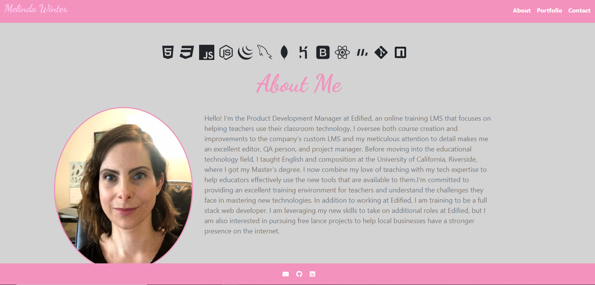
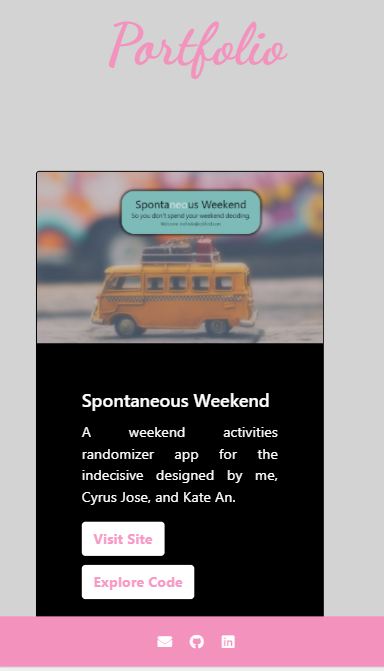
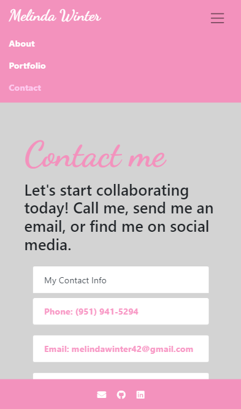

# React Portfolio 

## Description

<https://melindawinter.github.io/react-portfolio/>

This is a website intended to host my professional information and contact details. It is designed to be responsive and look great on big and small screens. This is a long-term project that I will continue to build and refine. The site has working navigation links that let users easier travel between the About, Portfolio, and Contact pages. There are also links in the footer that will allow visitors to easily email me or see my LinkedIn and GitHub profiles.

## Table of Contents

- [Installation](#installation)
- [Usage](#usage)
- [Technologies](#technologies)
- [License](#license)
- [Contributing](#contributing)
- [Questions](#questions)

## Installation

If you would like to use part of this app, please clone my project. Make sure you have node.js installed on your computer. You can find the download here <https://nodejs.org/en/download/>.

## Usage

To start a version you have cloned, use npm start to run the app on the local host and view it in the browser.

## Technologies

This project was bootstrapped with [Create React App](https://github.com/facebook/create-react-app).

## License

GNU General Public License v3.0

The GNU License allows the software to be modified and distributed by other users. It does not impose any restrictions on the use of the software but requires that it remain open source.

## Contributing

Please contribute to this project if you feel that you can make the code more efficient. Create your own branch and submit a pull request. I ask that you follow the Contributor Covenant code of conduct: <https://www.contributor-covenant.org/version/2/0/code_of_conduct/code_of_conduct.md> 

## Questions

- [Github Profile](https://github.com/melindawinter)
- melindawinter42@gmail.com
- You can easily reach me by email or you can find me on LinkedIn here <http://www.linkedin.com/in/melinda-winter-34a25689>.
